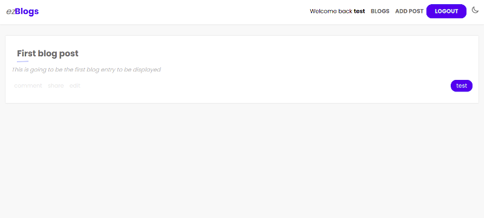

# Welcome to ezBlogs!

**ezBlogs** is a blogging platform that will aim for simplicity. It will have some social media features such as following and liking other peoples' posts.

The project is in really early development, and things will change, most probably a lot. Also this will run into many bugs, since I am using technologies I am still not so familiar with and this serves the purpose to learn them as I work with them. I decided to switch to Typescript for both front and back end, and use TypeORM instead of raw SQL.

### Why ezBlogs?

Simply said, it is a way for me to grow as a developer. This will not be a small project that I will just finish in a few days and forget about it. I plan in developing this project further and implement many features that I already have planned, but as I am really early in my web developer career, some features will take some time to be implemented.

### Future plans

There are some features that will be implemented really early in development, and some other features may take some time for me to figure out how to implement correctly, but they will come.

#### Can I contribute?

Of course you can! Any kind of contributions are welcome.  
Are you a passionate front end developer with a love for UI/UX design? Feel free to improve the -_really basic_- design that I have come up with. The project is built using **_SASS_**, so all the components and layouts are structured to make it easy to edit/improve.

If you have experience using **_SASS_** and would like to restructure the files, feel free to do so, I am always looking to learn better ways to structure the styling files.

If you are a back end developer and would also like to contribute, you are more than welcome to do so.

### To-do list _(short term)_

- [x] Finish the **alpha** version
- [x] Login / Signup
- [x] Post / Get blog entries
- [x] **Implement persistent sessions** _(Currently logs you out on refresh)_
- [ ] Implement protected sites with `react-router-dom`
- [ ] Sanitize forms & display form errors
- [ ] Improve React/Typescript code
- [ ] Restructure files and folders
- [ ] Implement Light/Dark mode
- [ ] Make site responsive

These are some of the short term changes that will be implemented. Priority is to implement the persistent session feature, because logging in each time you refresh the page can get rather annoying.

Some of the not so important features that will be implemented after the essential ones are liking posts, following author, comment posts... and more!

### Technologies used

This project is using the PERN stack. ProstgreSQL for the databse, React for the frontend and NodeJS and Express for the backend.

### Demo

You can acces a live demo [demo](https://blog.daniel-ulises.me)

If you want to test it without registering, you can use this user:

**username:** test@mail.com  
**password:** test123

## Note

Keep in mind that this is a very young project that is still being developed. Anything in the current version is subjective to change, and things will change. For now, the database may be wiped anytime due to me still discovering new techniques with SQL, and will most probably change the architecture of the database. You can still register and play with it if you wish, but for now anything can be changed and/or deleted at anytime, so keep that in mind.

Once a mature version is out that can be used persistently, it will be tagged as such. For now during alpha, everything is subjective to change.
